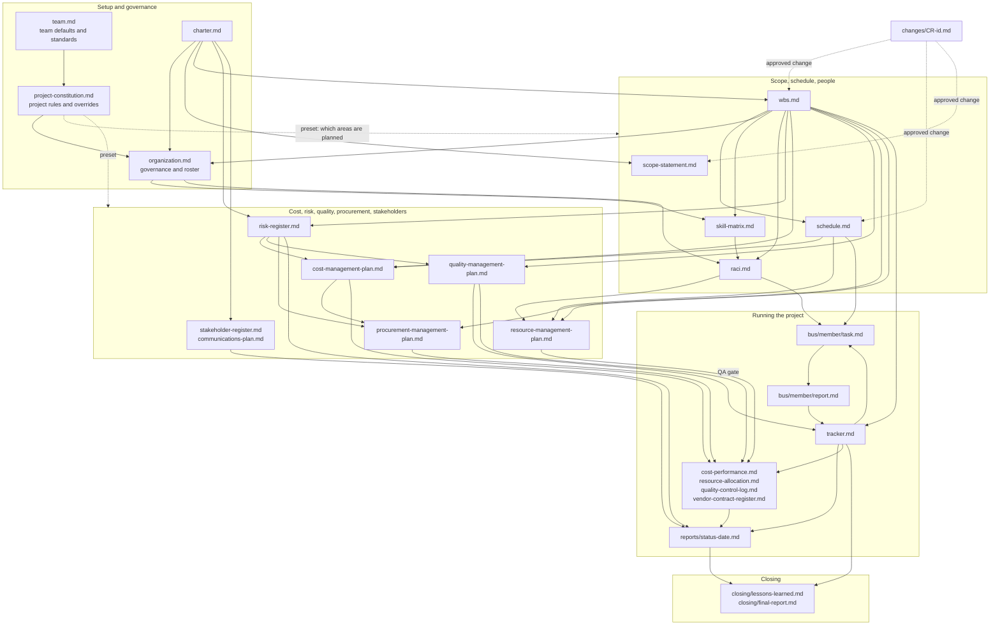

# Artifact Reference

Every file in a project's `.pmo/` folder, who owns it, which command creates it, and whether you can
change it freely. See a filled-in set in the [example project](../example/README.md).

**Kinds of file**

| Kind | Meaning |
|---|---|
| **Baseline** | Approved by you and then frozen. It changes only through [`/pf-change-request`](command-reference.md#change-and-decisions). |
| **Living** | Updated continuously as the project runs, with no Change Request. |
| **Record** | Written once as history. Never deleted. |

**One owner per file.** Other agents may read any file but must not overwrite one they do not own;
they propose the change to the owner. The owner list is also in the
[working agreement](../../.github/copilot-instructions.md#artifact-ownership).

## How the files relate

An arrow means "is read to produce". Which files exist depends on the
[preset](how-a-project-runs.md#workflow-presets); optional ones may be missing. Change Requests (dotted)
are the only way to edit the baseline files after approval.

Reading it: `team.md` feeds the constitution; the charter feeds scope, the WBS, risks and
stakeholders; the WBS is the hub that nearly every plan reads; the tracker, task, and report files
form the work loop; and status reports and the closing files read what the loop produced.

## Setup and governance

| File | Owner | Made by | Kind | Holds | Template |
|---|---|---|---|---|---|
| `team.md` | Planner | `/pf-setup-init` | Baseline | Team-wide defaults (preset, cost mode, cadence, thresholds) and standing rules. Created in pass 1 of `/pf-setup-init` and must be filled in before pass 2 will run; see [how to fill it in](getting-started.md#about-teammd). | `team.template.md` |
| `project-constitution.md` | Planner | `/pf-setup-project-constitution` | Baseline | The preset, principles, decision authority, reporting cadence, escalation rules, Definition of Done | `project-constitution.template.md` |
| `charter.md` | Planner | `/pf-setup-charter` | Baseline | Purpose, objectives, scope, constraints, milestones, sponsor's approval | `charter.template.md` |
| `organization.md` | Project Manager | `/pf-setup-organization`, `/pf-plan-organization` | Governance and roles are baseline; the roster is living | Governance structure, role definitions, the team roster (Person, AI, Vendor), org change log | `organization.template.md` |

## Scope, schedule, and people

| File | Owner | Made by | Kind | Holds | Template |
|---|---|---|---|---|---|
| `scope-statement.md` | Planner | `/pf-plan-scope-wbs` | Baseline | Scope, deliverables with acceptance criteria, exclusions | `scope-statement.template.md` |
| `wbs.md` | Planner | `/pf-plan-scope-wbs` | Baseline | The hierarchy of work and a dictionary entry for every work package | `wbs.template.md` |
| `schedule.md` | Planner | `/pf-plan-schedule` | Baseline | Milestones, sequence, critical path | `schedule.template.md` |
| `skill-matrix.md` | Resource Manager | `/pf-plan-skills` | Living | Skills, requirements per work package, coverage per member, gaps. Ratings of named people are sensitive. | `skill-matrix.template.md` |
| `raci.md` | Project Manager | `/pf-plan-organization` | Living | Who is Responsible, Accountable, Consulted, and Informed for each work package | `raci.template.md` |

## Cost, risk, quality, procurement, and stakeholders

| File | Owner | Made by | Kind | Holds | Template |
|---|---|---|---|---|---|
| `cost-management-plan.md` | Cost Manager | `/pf-plan-cost` | Baseline | Tracking mode, estimates, budget, reserves, thresholds | `cost-management-plan.template.md` |
| `cost-performance.md` | Cost Manager | `/pf-control-cycle` | Living | Budget against actual (or earned value figures) | `cost-performance.template.md` |
| `risk-register.md` | Risk Manager | `/pf-plan-risk`, then ongoing | Living | Scored risks, responses, owners, triggers | `risk-register.template.md` |
| `quality-management-plan.md` | Quality Manager | `/pf-plan-quality` | Baseline | Standards, metrics, QA gate criteria | `quality-management-plan.template.md` |
| `quality-control-log.md` | Quality Manager | `/pf-check-report`, `/pf-control-cycle` | Living | Gate results, defects, trend notes | `quality-control-log.template.md` |
| `procurement-management-plan.md` | Procurement Manager | `/pf-plan-procurement` | Baseline | Make-or-buy results, selection criteria, contract types, thresholds | `procurement-management-plan.template.md` |
| `vendor-contract-register.md` | Procurement Manager | `/pf-plan-procurement`, `/pf-control-cycle` | Living | Each vendor's contract, value, status, performance | `vendor-contract-register.template.md` |
| `stakeholder-register.md` | Stakeholder Manager | `/pf-plan-stakeholders` | Living (sensitive) | Power, interest, attitude, and an engagement strategy for each stakeholder | `stakeholder-register.template.md` |
| `communications-plan.md` | Stakeholder Manager | `/pf-plan-stakeholders` | Living | Who is told what, how often, through which channel | `communications-plan.template.md` |
| `resource-management-plan.md` | Resource Manager | `/pf-plan-resources` | Baseline | Effort, calendars, capacity, how roles are staffed | `resource-management-plan.template.md` |
| `resource-allocation.md` | Resource Manager | `/pf-control-cycle` | Living | Assignment and utilization per person, with conflicts | `resource-allocation.template.md` |

## Running the project

| File | Owner | Made by | Kind | Holds | Template |
|---|---|---|---|---|---|
| `tracker.md` | Project Manager | `/pf-start-manager`, `/pf-check-report` | Living | Status, percent complete, dates, and variance for each work package | `tracker.template.md` |
| `automation-rules.md` | Project Manager | You write the rules | Living | Rules that flag a condition (such as a cost overrun) at each control cycle. A rule only flags; it never acts. | `automation-rules.template.md` |
| `bus/<member>/task.md` | Project Manager | `/pf-assign-task` | Record | A self-contained task for one AI team member | `work-package.template.md` |
| `bus/<member>/report.md` | The team member | `/pf-start-team-member` | Record | What the team member delivered and what it needs next | none |
| `memory/work-packages/WP-<id>.md` | The team member | `/pf-start-team-member` | Record | A working log of decisions, deviations, and blockers | none |
| `reports/status-<date>.md` | Project Manager | `/pf-control-cycle` | Record | A status report with an overall Green, Yellow, or Red | `status-report.template.md` |
| `changes/CR-<id>.md` | Project Manager | `/pf-change-request` | Record | A change, its impact, options, and decision | `change-request.template.md` |
| `decisions/DEC-<id>.md` | Project Manager | `/pf-log-decision` | Record | A judgment call that changes no baseline | `decision-record.template.md` |

## Agile layer (optional)

| File | Owner | Made by | Kind | Holds | Template |
|---|---|---|---|---|---|
| `sprint-backlog.md` | Scrum Master | `/pf-agile-sprint-planning`, `/pf-agile-backlog-refinement`, `/pf-agile-sprint-review` | Living | Sprints, their work packages and review outcomes, upcoming candidates | `sprint-backlog.template.md` |
| `standup-log.md` | Scrum Master | `/pf-agile-standup` | Record | Dated standup entries | `standup-log.template.md` |
| `retro-log.md` | Scrum Master | `/pf-agile-sprint-retro` | Record | Dated retrospectives and action items | `retro-log.template.md` |

## History

| File | Owner | Made by | Kind | Holds | Template |
|---|---|---|---|---|---|
| `archives/<stage>/stage-summary.md` | Project Manager | `/pf-session-archive-stage` | Record | A summary of a finished stage and the list of files moved | `stage-summary.template.md` |
| `closing/lessons-learned.md` | Planner and Project Manager | `/pf-close-project` | Record | What went well, what did not, recommendations | `lessons-learned.template.md` |
| `closing/final-report.md` | Planner and Project Manager | `/pf-close-project` | Record | Objectives against outcomes, variances, risks that happened | none |

## Notes

- Agents read a stage's `stage-summary.md` rather than its archived files, unless the summary points
  to a specific file.
- A file for an optional phase may simply not exist. Later commands treat that as skipped on purpose.
- Registers are Markdown tables so scripts can check them; `pf_validate.py` verifies IDs, scores,
  the RACI rule, the roster, and the skill matrix.
