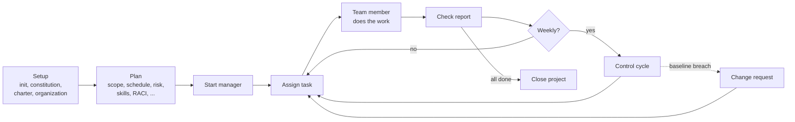

# How a Project Runs

This page explains the ideas behind ProjectFabric. Read it once before your first project, and come
back when something surprises you. Terms you may not know are explained in the
[glossary](#glossary-for-newcomers).

## The short version

- A project is a folder of plain Markdown files called `.pmo/`. That folder is the project's memory.
  Chat conversations are not.
- Specialist agents each own some of those files. You talk to them in Copilot Chat by typing
  slash commands such as `/pf-plan-risk`.
- The agents draft and recommend. You approve. Nothing becomes the plan until you say so.
- Once you approve a plan file it becomes a baseline. Changing it later goes through a Change Request.

## The three conversations

You run a project in three kinds of chat. Keep them separate; they share nothing except the `.pmo/` files.

| Conversation | Used for | Commands | How many |
|---|---|---|---|
| **Planner** | Setting up and planning the project | `/pf-setup-*` and `/pf-plan-*` | One, for the whole planning phase. The command switches the agent's role as needed (Risk Manager, Cost Manager, and so on). |
| **Manager** | Running the project once planning is done | `/pf-start-manager`, `/pf-assign-task`, `/pf-check-report`, `/pf-control-cycle`, `/pf-change-request`, `/pf-log-decision`, and the `/pf-agile-*` and `/pf-session-*` commands | One at a time. If it gets long, hand off to a fresh one with `/pf-session-handoff`. |
| **Team Member** | Doing one work package as an AI team member | `/pf-start-team-member` | One per AI team member who has a task, so several can run in parallel. |

Why separate chats? A long single chat forgets and drifts. Separate chats that each re-read the
files stay accurate, and you can always see what an agent knew by looking at the files.

## The lifecycle

1. **Setup** creates the files and agrees the rules: who decides what, and who is on the team.
2. **Planning** builds the baselines. Each planning command ends with your review.
3. **The work loop** repeats: the Manager dispatches a work package, a team member does it, the
   Manager checks the report and updates the tracker. A **control cycle** reviews the whole project
   (usually weekly) and writes a status report.
4. **Closing** records lessons learned and a final report.

The full ordered command list, with what each one needs from you, is in the
[command reference](command-reference.md).

## Team members: people, AI agents, and vendors

The roster in `organization.md` lists every team member as one of three types:

| Type | What it is | How work reaches them |
|---|---|---|
| **Person** | A human on your team | The Manager prepares a brief for you to hand over; they report back to you, and you tell the Manager through `/pf-check-report`. |
| **AI** | An agent that does the work in its own chat | `/pf-assign-task` writes a task file in `bus/<member>/`; you open a chat and run `/pf-start-team-member`. |
| **Vendor** | An outside company | Same as a person, with a contract noted in the vendor register. |

Each member has a Member ID (for example `priya-nair` or `agenda-agent`). It is the column heading in
the RACI matrix, and for an AI member it is also the name of their task folder.

## Workflow presets

Not every project needs every planning step. The preset is set in your team's `team.md`, which you fill in during `/pf-setup-init`. Pass 2 copies it into the Project Defaults table of `project-constitution.md`, where agents read it; later edits to `team.md` do not change a running project:

| Preset | Use it when | What it means |
|---|---|---|
| **classic-waterfall** | The project is large, regulated, or fixed up front | Every planning area is required before work starts |
| **agile-hybrid** | The scope will change as you learn | Scope, schedule, risk, stakeholders, organization, and RACI are required; cost, quality, procurement, and resource planning are pulled in only when needed; the Scrum ceremonies are on |
| **lean** | The project is small or short | Only the charter, scope, schedule, and RACI are required |
| **pi-cadence** | A product plans a year roughly and ships in fixed-length increments | A yearly roadmap, then each Program Increment (PI) planned only after the last one closes, with the date fixed and scope flexible. Five practices (objectives with a confidence vote, WSJF, a PI review, ROAM risks, a predictability metric) are switched on or off in the constitution |

When a step is optional, the agent asks once whether you want it. If you skip it, nothing breaks:
later commands treat a missing optional file as skipped on purpose. The exact required and optional
list is in the [presets table](../knowledge-areas.md#workflow-presets).

## State lives in files

Every artifact is a Markdown file in `.pmo/` with a single owner. You can read, search, and review them
with any tool, and put them in git. Examples:

- `charter.md`, `wbs.md`, `schedule.md`: the plan
- `risk-register.md`, `stakeholder-register.md`, `tracker.md`: registers that change as you go
- `bus/<member>/task.md` and `report.md`: the hand-off between the Manager and an AI team member
- `reports/status-<date>.md`, `changes/CR-<id>.md`, `decisions/DEC-<id>.md`: the project's history

Each file and its owner is listed in the [artifact reference](artifact-reference.md). You can see a real
set in the [example project](../example/README.md).

## Baselines and change control

Some files are **baselines**: the charter, WBS, schedule, and the plans for cost, resources, quality,
and procurement. Once you approve one, agents will not edit it directly. If the plan has to change,
`/pf-change-request` records why, shows the impact on scope, schedule, cost, and risk, and offers
options. You approve or reject it. Only then are the baseline files updated.

Other files are **living**: the risk register, tracker, status reports, and the team roster. They
change all the time without a Change Request.

A **decision** (`/pf-log-decision`) is for a judgment call that does not change any baseline, for
example choosing between two equally good options. A Change Request is for anything that does.

## Your role: the checkpoint

You are not a passenger. In every phase you:

- **Approve** each plan before it becomes a baseline.
- **Approve** each work package assignment before it is dispatched.
- **Supply** the numbers and judgments only you have: estimates, probabilities, skill ratings,
  attitudes of stakeholders. Agents never invent these. If you do not know, they record `TBD`.
- **Decide** whether to waive a readiness check, accept a risk, or approve a change.

Agents end every response by telling you the next command and which conversation to run it in.

## Glossary for newcomers

| Term | Plain meaning |
|---|---|
| **Charter** | A one-page "why this project exists", with objectives and a sponsor's approval |
| **Sponsor** | The person who owns the budget and has the final say |
| **WBS** | A breakdown of the project into deliverables and small **work packages** |
| **Work package** | A piece of work small enough for one person or agent to finish and report on |
| **Acceptance criteria** | A testable statement of what "done" means for a work package |
| **Baseline** | An approved plan that only changes through a Change Request |
| **RACI** | A table saying who is Responsible, Accountable, Consulted, and Informed for each work package. Exactly one person is Accountable. |
| **Risk** | Something that might go wrong, scored by probability and impact |
| **Stakeholder** | Anyone affected by or able to influence the project |
| **Control cycle** | A regular check of progress against the plan, ending in a status report |

## Notes for experienced project managers

| If you know this | In ProjectFabric |
|---|---|
| Knowledge areas (PMBOK) | One agent per area: Scope and Schedule (Planner), Cost, Risk, Quality, Procurement, Resource, Stakeholder, and Integration (Project Manager). See [knowledge areas](../knowledge-areas.md). |
| Process groups | Initiating, Planning, Executing, Monitoring and Controlling, and Closing map to the command groups in the [working agreement](../../.github/copilot-instructions.md#process-group-mapping). |
| Project management plan | The set of baseline files in `.pmo/`, one per area, rather than one large document |
| Integrated change control | `/pf-change-request`; the Change Control Authority is named in `organization.md` |
| Lessons learned register | `closing/lessons-learned.md`, written at the end from stage summaries |
| Tailoring | The Workflow Preset, plus the constitution for project-specific rules and `team.md` for team-wide defaults |
| Earned value | Optional Full EVM mode in the cost plan; the figures are computed by a script, not by the agent |
| Scrum alongside a plan | The optional Agile layer. There is no Product Owner agent; you accept or reject work at the sprint review. |
